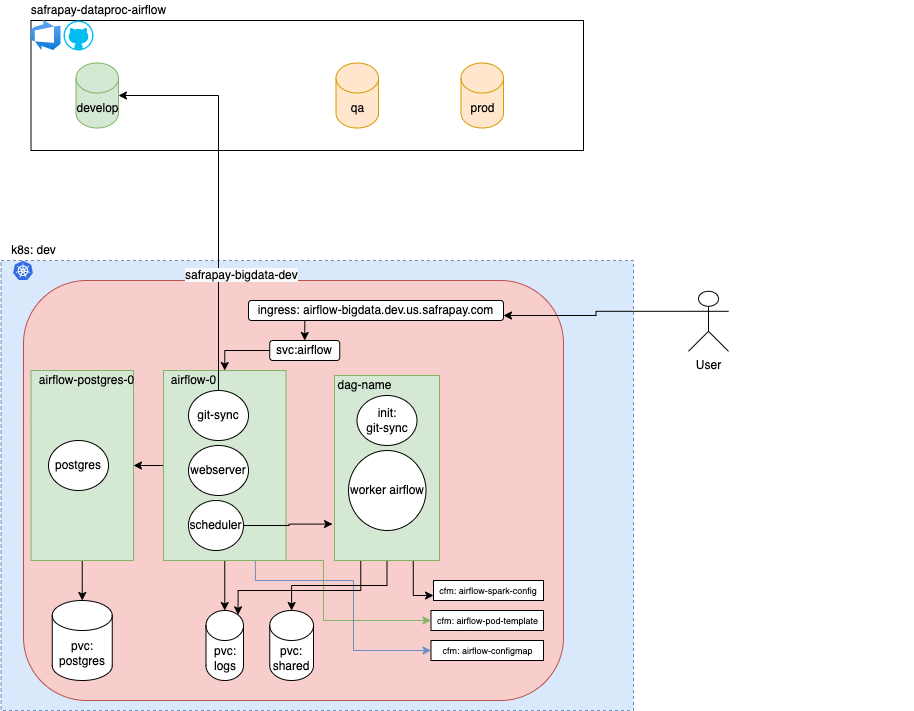

## Airflow

### Introduction

Airflow deployment has the following components:

  - 1-configmap.yaml - The configmaps used by airflow, they are:
    - airflow-spark-config - contains the configuration of spark-defaults.conf
    - airflow-pod-template - it is the template of Airflow Worker. This file is mounted on /opt/airflow/kubernetes/pod_template/template.yaml
    - aiflow.cfg - This is the config file from airflow itself. In this file are all configuration from Airflow like dags_folder and kubernetes

  - 2-service.yaml - The service manifest with two services:
    - airflow-webserver port 80 to 8080 - Airflow's web ui
    - airflow-postgre port 5432 to 5432 - PostgresDB port

  - 3-serviceaccount.yml - The service account to Airflow Scheduler be able to create and delete the Workers. The configuration of which service account to use is on airflow.cfg confimap

  - 4-ingress.yaml - The Traefik ingressRoute from airflow with redirect http to https

  - 5-pvc.yml - The PVC used by airflow and airflow Postgres:
    - airflow-dags - we should have to change this name. We are using this PVC to have a shared persistent volume between Airflow Workers.
    - airflow-logs - Used to save the logs from Workers. It is mounted on Airflow Webserver too.
    - airflow-postgres - Persistent volume to PostgresDB

  - 6-stsAirflow.yaml - The Airflow statefulset manifest. There are three containers in this pod, the webserver, scheduler and the git-sync(to sync dags from git to airflow)

  - 7-stspostgres.yaml - The Airflow PostgresDB statefulset manifest.

### Architeture

